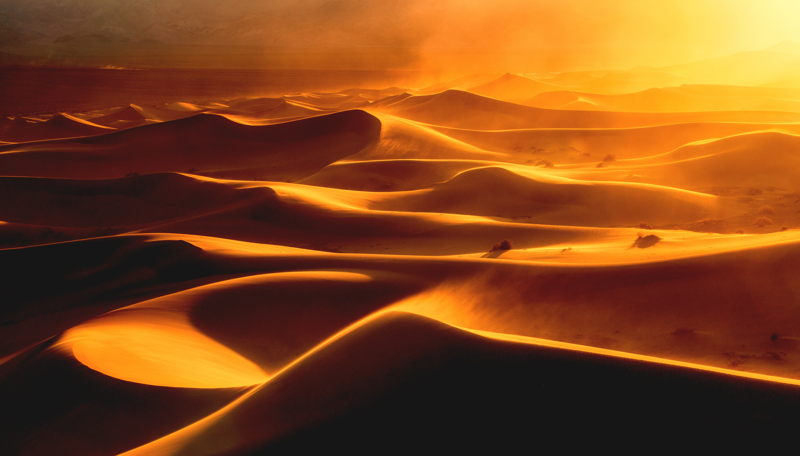
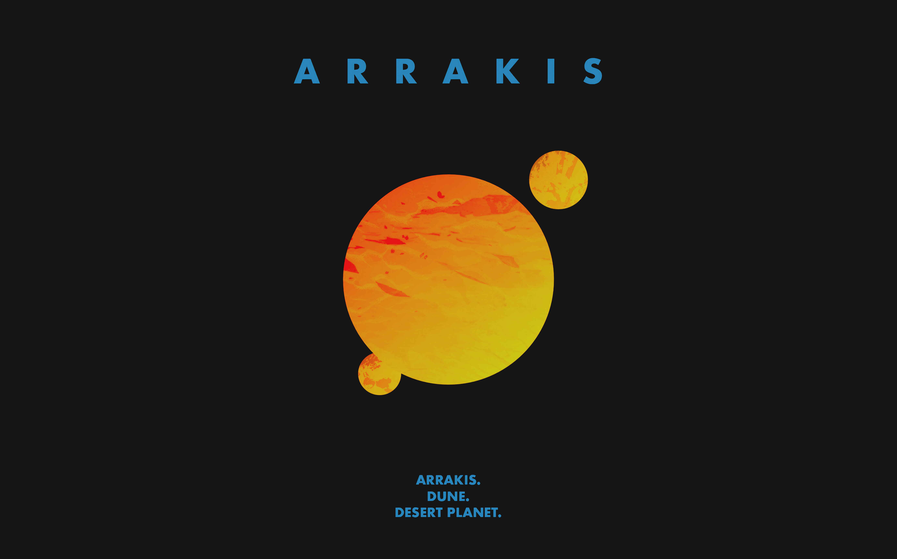
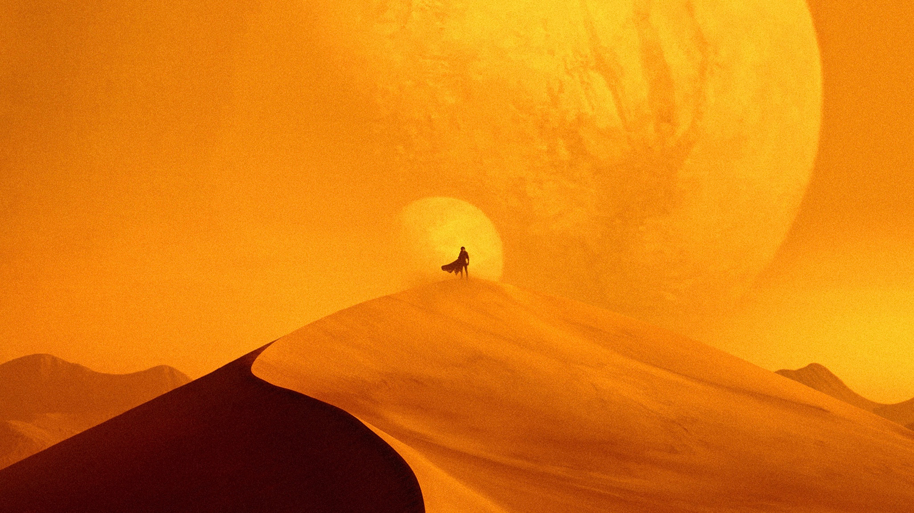
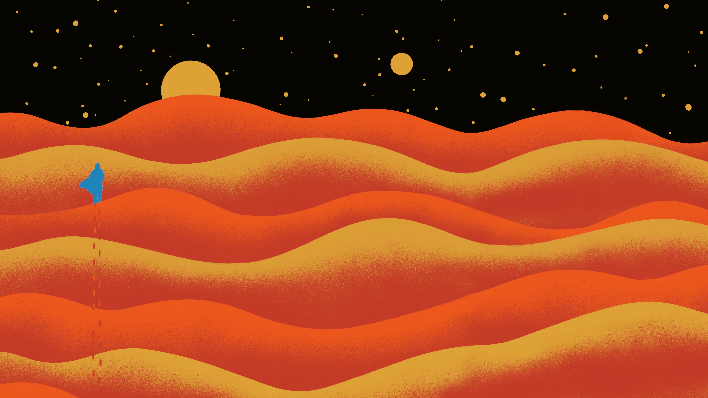
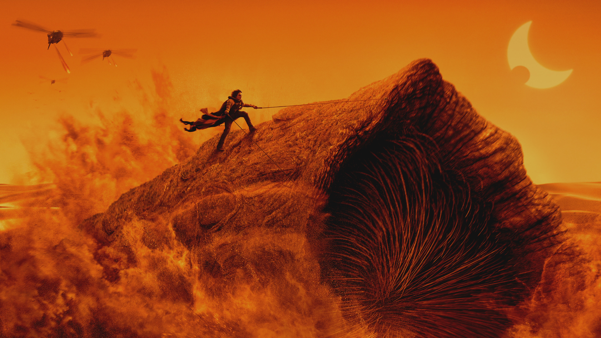
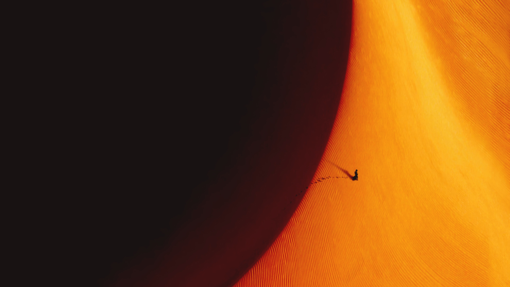
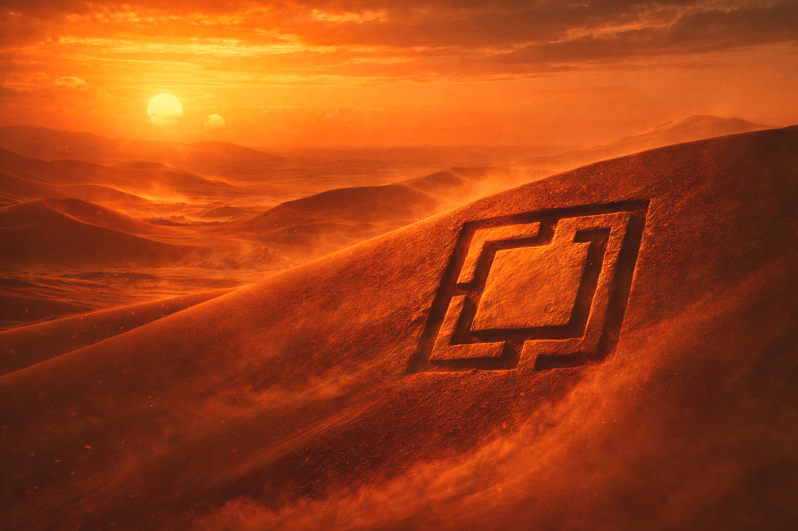

# Omarchy Dune Theme

From dust, discipline. From heat, clarity. Dune draws Arrakis into Omarchy in spice-burnt orange, sand-muted text, dark stone shadow, and a faded teal that glints at the edge like a vision half-revealed. Severe, deliberate, and touched with prophecy, it is still meant to hold up under daily use instead of collapsing into ornament.

## Preview


## Install

Install it with the standard Omarchy flow:

```bash
omarchy-theme-install https://github.com/OldJobobo/omarchy-dune-theme
```

## What's Included

- A standalone Neovim colorscheme plugin with `colors/dune.lua` and the `lua/dune/` module tree, so `:colorscheme dune` works directly from the active Omarchy theme directory.
- Companion theme files for Vencord, Warp, Chromium, and Zed.
- Shared palette sources in CSS and TOML form for keeping custom integrations aligned.

## Wallpapers

<table>
  <tr>
    <td></td>
    <td></td>
    <td></td>
  </tr>
  <tr>
    <td></td>
    <td></td>
    <td></td>
  </tr>
  <tr>
    <td></td>
    <td></td>
    <td></td>
  </tr>
  <tr>
    <td></td>
    <td></td>
    <td></td>
  </tr>
  <tr>
    <td></td>
    <td></td>
  </tr>
</table>

## Notes

- `neovim.lua` is wired to Omarchy's active theme directory, so the bundled colorscheme loads as a local plugin when this theme is active.

## Attribution

- Built around the desert-industrial mood of Dune, with the usual amount of reverence for spice, dust, and sealed metal.
